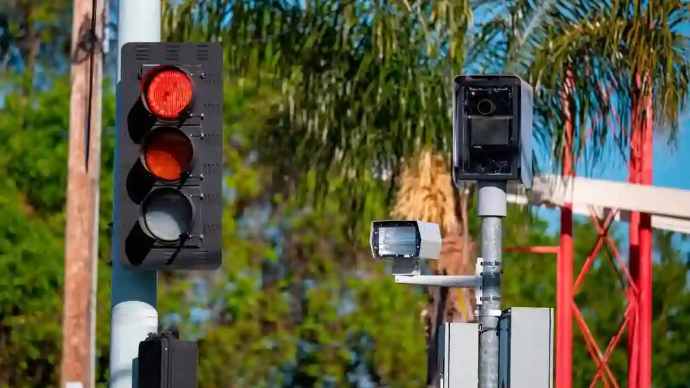

# Burlingame Red Light Running Object Detection

Real-time object detection system using Raspberry Pi 5 and Hailo-8 AI accelerator. This project is a heavily modified fork of [Hailo-8-Object-Detection-Examples](https://github.com/hailo-ai/hailo-rpi5-examples). Huge thumbs up and a thank you for providing enough resouces to get me started with the Hailo-8 chip on a pi.

## Table of Contents

- [Overview](#overview)
- [Hardware Requirements](#hardware-requirements)
- [Installation](#installation)
- [Quick Start](#quick-start)
- [Architecture](#architecture)
- [Performance](#performance)
- [Contributing](#contributing)
- [License](#license)

## Overview

This project implements real-time object detection using the Hailo-8 AI Accelerator with Raspberry Pi 5. The primary goal of this project is to keep a real time, live webcam that analyzes the predestrian crossing and keeps track of how often vehicles run the red light.

## Hardware Requirements

- Raspberry Pi 5 (8GB RAM recommended)
- Hailo-8 AI Accelerator
- Camera module
- Power supply
- (Optional) Cooling solution

## Installation

1. Clone repository:

```bash
git clone https://github.com/imaspork/raspberry-pi-hailo-traffic-detection.git
cd traffic-detection
```

2. Install dependencies:

```bash
sudo apt install hailo-all
```

```bash
source setup_env.sh
```

```bash
cd traffic-watcher
npm install
```

## Quick Start

1. Run detection in the root of the project:
   Running this command will bring 3 things up:

- A web server that serves the web client
- A websocket server that streams the video feed and object detection data
- A python script that runs the object detection pipeline using a webcam

```bash
./start.sh
```

## Architecture

The system consists of three main components:

- Detection Pipeline: Handles object recognition
- API Service: Handles data processing such as streaming and graph visualization data requests
- Web Client: Hosts a live client to the user to view the object detection stream and data visualizations

To view more details on what each file is responsible for, [read here](docs/detection-pipeline.md)

## Cloudflare Tunnel for Web Client Hosting

In order to utilize a domain and steam to it, we must configure a cloudflare tunnel connection and set the NEXT_PUBLIC_BASE_DOMAIN_URL [environment variable file](traffic-watcher/.rename) in the web client to the domain registered on cloudflare tunnels. We must rename the .rename file to .env

To further increase security since we are exposing the raspberry pi to the open web, it is _highly recommended_ to create an SSL certificate and upload it to cloudflare tunnels. Besides, the websockset stream uses wss, which can not be utilized without SSL.

More details in [Architecture Documentation](docs/architecture.md)

## License

This project is licensed under the MIT License - see [LICENSE](LICENSE) file.
